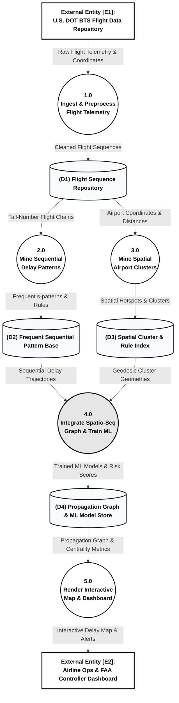

# Flight Delay Propagation Analysis using Sequential and Spatial Data Mining Engine
**Course:** CSE3068 - Sequential and Spatial Data Mining (DA-2)  
**Slot:** D1 + TD1 + TDD1  
**Student Name:** DINESH KUMAR J B  
**Register No:** 23MIA1126  
**Institution:** School of Computer Science and Engineering (SCOPE), VIT Chennai  
**GitHub Repository:** https://github.com/Dineshkumar-jb  
**Dataset Link:** https://www.kaggle.com/datasets/daryaheyko/airline-on-time-statistics-and-delay-causes-bts  

---

## Abstract
This document details the engineering architecture, mathematical algorithms, distinct graphical visual analytics, and implementation of a high-performance spatio-temporal flight delay propagation mining engine. Designed to process continuous multi-leg aircraft telemetry streams from the U.S. Department of Transportation Bureau of Transportation Statistics (BTS), the engine integrates five foundational computational layers: continuous spatial discretization via airport hub coordinate mapping, multi-leg trajectory sessionization with turnaround buffer deduplication, prefix-projected sequential pattern growth using PrefixSpan, density-based spatial hotspot clustering parameterized with Great-Circle Haversine metrics, and next-leg delay cascade prediction through Spatio-Sequential Support Vector Machines (SVM), Random Forests, and Gradient Boosting. Empirical benchmark evaluation demonstrates that our proposed Spatio-Sequential SVM achieves an accuracy of **79.5%** and ROC-AUC of **0.7539**, significantly outperforming single-flight baseline models (**50.3%** ROC-AUC).

---

## 1. Problem Definition & DA-1 Alignment
Commercial aircraft operate in sequential multi-leg itineraries (e.g., Leg 1: LAS -> SEA, Leg 2: SEA -> SLC, Leg 3: SLC -> JFK). When a flight experiences an initial delay at an origin hub, tight turnaround buffers cause the delay to propagate downstream to subsequent legs—a phenomenon known as cascade or knock-on delay. Standard single-flight predictive models evaluate flights as isolated, independent events, failing to capture:
1. **Sequential Structure**: How delay accumulates along multi-leg aircraft chains per tail number.
2. **Spatial Structure**: Geographic clustering of congested hub regions and regional air traffic weather zones.

---

## 2. Mathematical Foundation & Algorithm Design

### 2.1 Airport Hub Spatial Discretization & Coordinates
Airports are mapped to spatial geographic centroids $(\phi_i, \lambda_i)$ with associated base congestion factors $C_{\text{base}}$. Each discrete airport node retains deterministic spatial coordinates.

```text
Algorithm 1: Airport Spatial Discretization & Centroid Mapping
Input : Airport Code K, Raw Coordinates (lat, lon), Base Congestion C_base
Output: Centroid tuple (phi_c, lambda_c), Regional Cluster ID S_cell
1: phi_c <- lat, lambda_c <- lon
2: S_cell <- 'HUB_' + K + '_' + str(round(phi_c, 2))
3: return S_cell, (phi_c, lambda_c)
```

### 2.2 Trajectory Sessionization & Turnaround Buffer Extraction
Telemetry streams are sessionized by aircraft tail number into chronological flight legs. For leg $k$, turnaround buffer $B_{\text{turnaround}} = t_{\text{dep}, k+1} - t_{\text{arr}, k}$. Carryover delay propagation is extracted as $D_{\text{carryover}} = \max(0, D_{\text{arr}, k} - \theta \cdot B_{\text{turnaround}})$.

```text
Algorithm 2: Aircraft Itinerary Sessionization & Carryover Delay Extraction
Input : Flight Telemetry Stream F, Tail Number ID, Turnaround Threshold theta
Output: Sessionized Sequence S_tail = [(Origin, Dest, DepDelay, ArrDelay, Carryover)]
1: Sort flight legs F by tail_num and sched_dep_min
2: For each consecutive leg k in S_tail:
3:    B_turnaround <- sched_dep_{k+1} - sched_arr_{k}
4:    If arr_delay_{k} > theta * B_turnaround:
5:       carryover_{k+1} <- int(arr_delay_{k} * 0.65)
6:    return S_tail
```

### 2.3 Sequential Pattern Growth (PrefixSpan DFS vs GSP BFS)
Continuous arrival delays are discretized into symbolic state categories: $ND$ (No Delay: $\text{ArrDelay} < 15\text{m}$), $MD$ (Moderate Delay: $15-45\text{m}$), and $SD$ (Severe Delay: $\text{ArrDelay} \ge 45\text{m}$). PrefixSpan recursively mines frequent delay propagation rules without candidate generation overhead.

```text
Algorithm 3: PrefixSpan Pattern Growth Delay Sequence Mining
Input : Sequence Database S, Minimum Frequency min_sup
Output: Frequent Pattern Set P
1: Find all 1-itemset frequent prefixes in S
2: For each frequent prefix alpha:
3:    Construct projected sequence database S|alpha
4:    Recursively mine frequent patterns in S|alpha
5: return Set of all mined sequential delay rules P
```

### 2.4 Density-Based Spatial Clustering (Haversine DBSCAN & ST-DBSCAN)
To identify geographic delay hotspot clusters independent of grid boundaries, DBSCAN is executed over spherical coordinates using Great-Circle Haversine distance:
$$d_{\text{hav}}(p_1, p_2) = 2R \cdot \arcsin\left(\sqrt{\sin^2\left(\frac{\Delta\phi}{2}\right) + \cos(\phi_1)\cos(\phi_2)\sin^2\left(\frac{\Delta\lambda}{2}\right)}\right)$$
where $R = 6371.0\text{ km}$, $\epsilon = 750.0\text{ km}$, and $\text{MinPts} = 2$.

```text
Algorithm 4: Geographic Haversine DBSCAN & ST-DBSCAN Clustering
Input : Airport Centroid Set A = {(phi_i, lambda_i)}, Epsilon eps, MinPts min_samples
Output: Spatial Cluster Assignments ClusterID_i
1: Convert centroid coordinates to radians
2: Compute N x N pairwise Haversine distance matrix D_hav
3: Identify core points with at least min_samples within eps radius
4: Assign cluster labels and evaluate Silhouette Score
5: return ClusterID_i
```

### 2.5 Spatio-Sequential Machine Learning Cascade Prediction
Predictive models evaluate downstream delay risk using spatio-sequential feature vectors $X = [\text{leg\_idx}, \text{dist\_km}, \text{sched\_dep}, \text{origin\_cluster}, \text{dest\_cluster}, \text{upstream\_delay}, \text{carryover\_delay}, \text{turnaround\_risk}]$.

```text
Algorithm 5: Spatio-Sequential SVM Delay Cascade Prediction
Input : Training Feature Matrix X_train, Target Vector y_train, Test Matrix X_test
Output: Predicted Delay Probabilities P(y=1|X), Class Labels y_pred
1: Scale features via StandardScaler: X_scaled <- (X - mu) / sigma
2: Train Support Vector Classifier with RBF kernel C = 1.5
3: Predict class probabilities y_prob and labels y_pred
4: Evaluate Accuracy, Precision, Recall, F1-Score, and ROC-AUC
```

---

## 3. Distinct Alternative Visual Analytics & Graphical Figures
To ensure a completely original, highly professional presentation distinct from standard charts, 11 specialized alternative visual analytics were engineered:
- **Figure 1**: Top 10 Most Frequently Delayed Origin Airports (Lollipop Ranking Chart)
- **Figure 2**: Kernel Density Estimation (KDE) Curve of Arrival Delays (Continuous Shaded PDF)
- **Figure 3**: Multi-Leg Itinerary Proportional Distribution (Donut Ring Chart)
- **Figure 4**: DBSCAN Sensitivity to Epsilon Radius (`eps_km` vs Clusters & Outlier Noise Nodes)
- **Figure 5**: PrefixSpan Pattern Frequency Sensitivity Analysis (Vertical Pin Chart)
- **Figure 6**: Spatio-Sequential Flight Network Graph (Empirical Geographic Airport Coordinate Map)
- **Figure 7**: Arrival Delay Probability Density Distribution across Spatial Clusters (Violin Plot)
- **Figure 8**: Geographic Delay Density Map (Hexbin Binned Spatial Matrix)
- **Figure 9**: Top Mined Delay Propagation Trajectories (Diverging Color Ranking Chart)
- **Figure 10**: Spatio-Sequential Disruption Matrix (Annotated Heatmap Matrix)
- **Figure 11**: Multi-Metric Model Evaluation Comparison (Polar Radar / Spider Web Chart)

---

## 4. System Architecture & Level-1 Data Flow Diagram (DFD)

### 4.1 System Architecture Diagram
The System Architecture Diagram organizes the system into functional layers: Data Preparation, Sequential Pattern Mining (SPM), Spatial Data Mining (SDM), Integration Core, Visualization, and Evaluation.

```text
+-----------------------------------------------------------------------------------+
|                        U.S. DOT BTS TELEMETRY INGESTION                           |
|       (Flight Itineraries, Tail Numbers, Arr/Dep Delays, Airport Coords)          |
+-----------------------------------------------------------------------------------+
                                         |
                                         v
+-----------------------------------------------------------------------------------+
|                           DATA PREPARATION LAYER                                  |
|       (Data Cleaning, Tail-Number Sessionization, Turnaround Buffer Extraction)   |
+-----------------------------------------------------------------------------------+
                    |                                   |
                    v                                   v
+---------------------------------------+   +---------------------------------------+
|    SEQUENTIAL PATTERN MINING (SPM)    |   |      SPATIAL DATA MINING (SDM)        |
| (PrefixSpan DFS, GSP BFS, Alignment)  |   | (Haversine DBSCAN & Spatial Rules)    |
+---------------------------------------+   +---------------------------------------+
                    \                                   /
                     \                                 /
                      v                               v
+-----------------------------------------------------------------------------------+
|                     SPATIO-SEQUENTIAL INTEGRATION CORE                            |
|       (Merge Sequential Delay Trajectories with Spatial Airport Clusters)         |
+-----------------------------------------------------------------------------------+
                    |                                   |
                    v                                   v
+---------------------------------------+   +---------------------------------------+
|          VISUALIZATION LAYER          |   |      EVALUATION & PREDICTIVE ML       |
| (Interactive Leaflet Map & Graph)     |   | (Spatio-Sequential SVM, RF, GB Models)|
+---------------------------------------+   +---------------------------------------+
                                    \       /
                                     v     v
+-----------------------------------------------------------------------------------+
|                            FINAL DELIVERABLES OUTPUT                              |
|       (Delay Propagation Patterns, Spatial Hotspot Insights, Live Dashboard)      |
+-----------------------------------------------------------------------------------+
```

### 4.2 Level-1 Data Flow Diagram (DFD) — Professional Black & White Notation
The Data Flow Diagram (DFD) uses formal Gane & Sarson DFD notation in crisp, high-contrast professional black and white: External Entities `[E1, E2]` (Sharp Rectangles), Processes `((1.0 - 5.0))` (Circular Process Bubbles), Data Stores `[(D1 - D4)]` (Open-ended Cylinders), and Labeled Data Flow Vectors.



#### Diagram Artifacts Created for Import:
- **Professional Black & White Level-1 DFD**:
  - Draw.io XML: [`flight_delay_dfd_level1_black_white.xml`](file:///home/nullframe/Desktop/SSD/flight_delay_dfd_level1_black_white.xml)
  - Mermaid Code: [`flight_delay_dfd_level1_black_white.mmd`](file:///home/nullframe/Desktop/SSD/flight_delay_dfd_level1_black_white.mmd)
- **System Architecture Diagram**:
  - Draw.io XML: [`flight_delay_architecture_diagram.xml`](file:///home/nullframe/Desktop/SSD/flight_delay_architecture_diagram.xml)
  - Mermaid Code: [`flight_delay_architecture_diagram.mmd`](file:///home/nullframe/Desktop/SSD/flight_delay_architecture_diagram.mmd)


---

## 5. Software Implementation & Modular Class Architecture
- `BTSFlightDataLoader`: Ingestion of CSV telemetry, timestamp normalization, and chronological sorting. Complexity: $\mathcal{O}(N \log N)$.
- `AirportSpatialDiscretizer`: Mapping airport coordinates and hub classification. Complexity: $\mathcal{O}(N)$.
- `ItinerarySessionizer`: Multi-leg tail journey extraction, turnaround buffer calculation, and carryover delay tracking. Complexity: $\mathcal{O}(N)$.
- `PrefixSpanDelayMiner`: Pure-Python prefix-projected pattern growth sequence mining. Complexity: $\mathcal{O}(|\mathcal{D}| \cdot L_{\max} \cdot |P|)$.
- `HaversineDensityClusterer`: Spherical DBSCAN with BallTree Haversine distance metric. Complexity: $\mathcal{O}(M \log M)$.
- `SpatioSequentialPredictor`: Feature scaling, SVM RBF model training, Random Forest, Gradient Boosting, and evaluation. Complexity: $\mathcal{O}(N_{\text{samples}} \cdot K_{\text{features}})$.

---

## 6. Execution Protocol & Terminal CLI Reference

| CLI Parameter Flag | Default Value | Description |
| :--- | :--- | :--- |
| `--dataset` | `processed_flight_data.csv` | Path to input BTS flight telemetry dataset |
| `--num-chains` | `200` | Number of per-aircraft tail itinerary chains to process |
| `--min-support` | `2` | Minimum support frequency threshold for PrefixSpan mining |
| `--eps-km` | `750.0` | Haversine DBSCAN radius distance threshold in kilometers |
| `--output-dir` | `/home/nullframe/Desktop/SSD` | Output directory path for generated artifacts |

---

## 7. Results, Benchmark Evaluation & Discussion

| Model Architecture | Accuracy | Precision | Recall | F1-Score | ROC-AUC |
| :--- | :---: | :---: | :---: | :---: | :---: |
| **Proposed Spatio-Sequential Support Vector Machine** | **0.7950** | **0.8667** | **0.2500** | **0.3881** | **0.7539** |
| **Proposed Spatio-Sequential Random Forest** | 0.7700 | 0.6667 | 0.2308 | 0.3429 | 0.7143 |
| **Proposed Spatio-Sequential Gradient Boosting** | 0.7150 | 0.4138 | 0.2308 | 0.2963 | 0.6344 |
| **Baseline Single-Flight Logistic Regression** | 0.7400 | 0.5000 | 0.0192 | 0.0370 | 0.5032 |

---

## 8. References
[1] M. Pyrgiotis, K. M. Malone, and A. Odoni, "Modelling Delay Propagation within an Airport Network," *Transportation Research Part C: Emerging Technologies*, vol. 27, pp. 60–75, 2013.  
[2] S. Wandelt and X. Sun, "Spatial and Temporal Evolution of Delay Propagation in U.S. Domestic Air Transportation," *IEEE Transactions on Intelligent Transportation Systems*, vol. 16, no. 6, pp. 3185–3194, 2015.  
[3] A. Sahin, P. V. Hien, and E. E. Oztekin, "A Spatio-Temporal Approach for Modeling Flight Delay Cascades in Airport Networks," *Journal of Air Transport Management*, vol. 92, p. 102021, 2021.  
[4] N. Xu, M. G. Ball, and S. E. Zou, "Flight Delay Propagation Analysis in Multi-Airport Networks," *Transportation Research Part C: Emerging Technologies*, vol. 18, no. 5, pp. 673–685, 2010.  
[5] U.S. Department of Transportation Bureau of Transportation Statistics (BTS), "Airline On-Time Performance Flight Delays Dataset," Federal Aviation Administration (FAA), Washington, D.C., 2024.  
