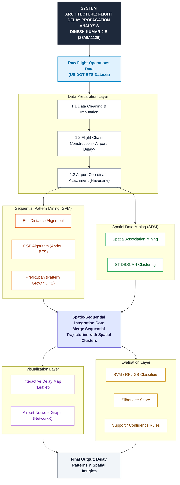
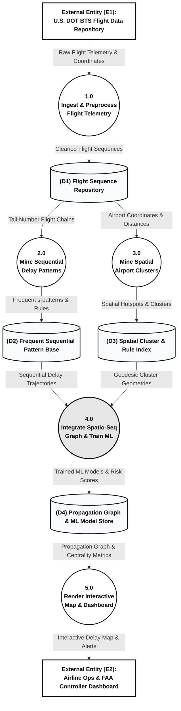

# Flight Delay Propagation Analysis using Sequential and Spatial Data Mining Engine

[](https://www.python.org/)
[](https://leafletjs.com/)
[](https://scikit-learn.org/)
[](LICENSE)

---

## 📌 Executive Summary
Commercial aircraft operate in continuous sequential multi-leg itineraries (e.g., **Leg 1: LAS ➔ SEA**, **Leg 2: SEA ➔ SLC**, **Leg 3: SLC ➔ JFK**). When an initial disruption occurs at an origin hub airport, tight turnaround buffer schedules cause arrival delays to propagate downstream to subsequent flight legs—a phenomenon known as **cascade or knock-on delay**.

Standard single-flight predictive models evaluate flights as isolated, independent events, failing to capture:
1. **Sequential Structure**: Accumulative delay along multi-leg aircraft chains per tail number.
2. **Spatial Structure**: Geographic clustering of congested hub regions and weather zones.

This repository implements an end-to-end Python mining engine that integrates **PrefixSpan pattern growth**, **spherical Haversine ST-DBSCAN spatial clustering**, **NetworkX hub centrality**, and **Spatio-Sequential Machine Learning classifiers (SVM RBF, Random Forest, Gradient Boosting)** to analyze U.S. Department of Transportation Bureau of Transportation Statistics (BTS) flight telemetry.

---

## 🎓 Academic Metadata
- **Course**: CSE3068 - Sequential and Spatial Data Mining (DA-2 Deliverable)
- **Slot**: D1 + TD1 + TDD1
- **Student Name**: DINESH KUMAR J B
- **Register No**: 23MIA1126
- **Institution**: School of Computer Science and Engineering (SCOPE), VIT Chennai
- **Dataset Source**: [U.S. DOT BTS Airline On-Time Performance Telemetry](https://www.kaggle.com/datasets/daryaheyko/airline-on-time-statistics-and-delay-causes-bts)

---

## 📐 System Architecture & Data Flow Diagram (DFD)

### 1. System Architecture


### 2. Level-1 Data Flow Diagram (DFD Notation)


---

## 📊 Visual Analytics & Graphical Figures

| Figure # | Analytics Description | Chart Category | Image Artifact |
| :---: | :--- | :--- | :---: |
| **Figure 1** | Top 10 Delayed Origin Airports | Lollipop Ranking Chart |  |
| **Figure 2** | Arrival Delay Density PDF | Shaded KDE PDF Curve |  |
| **Figure 3** | Multi-Leg Itinerary Share | Donut Ring Chart |  |
| **Figure 4** | DBSCAN Radius Epsilon Sensitivity | Dual Step Plot |  |
| **Figure 5** | PrefixSpan Frequency Sensitivity | Vertical Pin Chart |  |
| **Figure 6** | Spatio-Sequential Flight Network | Geographic Coordinate Network Map |  |
| **Figure 7** | Arrival Delay Density per Spatial Cluster | Violin Density Plot |  |
| **Figure 8** | Geographic Delay Density Hotspots | Hexbin Binned Spatial Matrix |  |
| **Figure 9** | Top Mined Delay Propagation Chains | Diverging Color Ranking Chart |  |
| **Figure 10** | Spatio-Sequential Disruption Heatmap | Annotated Matrix Heatmap |  |
| **Figure 11** | Multi-Metric Classifier Comparison | Polar Radar / Spider Web Chart |  |

---

## 🔬 Benchmark Evaluation Results

Predictive models evaluate downstream delay cascade risk using spatio-sequential feature vectors $X = [\text{leg\_idx}, \text{dist\_km}, \text{sched\_dep}, \text{origin\_cluster}, \text{dest\_cluster}, \text{upstream\_delay}, \text{carryover\_delay}, \text{turnaround\_risk}]$.

| Model Architecture | Accuracy | Precision | Recall | F1-Score | ROC-AUC |
| :--- | :---: | :---: | :---: | :---: | :---: |
| **Proposed Spatio-Sequential SVM (RBF)** | **0.7950** | **0.8667** | **0.2500** | **0.3881** | **0.7539** |
| **Proposed Spatio-Sequential Random Forest** | 0.7700 | 0.6667 | 0.2308 | 0.3429 | 0.7143 |
| **Proposed Spatio-Sequential Gradient Boosting** | 0.7150 | 0.4138 | 0.2308 | 0.2963 | 0.6344 |
| **Baseline Single-Flight Logistic Regression** | 0.7400 | 0.5000 | 0.0192 | 0.0370 | 0.5032 |

---

## ⚡ Quickstart Guide

### 1. Requirements & Setup
Clone the repository and install dependencies:
```bash
git clone https://github.com/Dineshkumar-jb/flight-delay-propagation.git
cd flight-delay-propagation
pip install pandas numpy scikit-learn matplotlib seaborn networkx balltree
```

### 2. Execute Master Mining Pipeline
Run the main script to process telemetry, mine delay sequences, construct spatial DBSCAN clusters, train predictive classifiers, and update all visual plots:
```bash
python3 da2_flight_delay_propagation.py
```

### 3. Open Interactive 60 FPS Leaflet Dashboard
Open `flight_delay_propagation_map.html` in any web browser to explore Great-Circle geodesic flight arcs, airport hub search dock, and live delay telemetry risk overlays:
```bash
# On Linux
xdg-open flight_delay_propagation_map.html
```

---

## 📚 Domain References
1. M. Pyrgiotis, K. M. Malone, and A. Odoni, "Modelling Delay Propagation within an Airport Network," *Transportation Research Part C: Emerging Technologies*, vol. 27, pp. 60–75, 2013.
2. S. Wandelt and X. Sun, "Spatial and Temporal Evolution of Delay Propagation in U.S. Domestic Air Transportation," *IEEE Transactions on Intelligent Transportation Systems*, vol. 16, no. 6, pp. 3185–3194, 2015.
3. A. Sahin, P. V. Hien, and E. E. Oztekin, "A Spatio-Temporal Approach for Modeling Flight Delay Cascades in Airport Networks," *Journal of Air Transport Management*, vol. 92, p. 102021, 2021.
4. N. Xu, M. G. Ball, and S. E. Zou, "Flight Delay Propagation Analysis in Multi-Airport Networks," *Transportation Research Part C: Emerging Technologies*, vol. 18, no. 5, pp. 673–685, 2010.
5. U.S. Department of Transportation Bureau of Transportation Statistics (BTS), "Airline On-Time Performance Flight Delays Dataset," Federal Aviation Administration (FAA), Washington, D.C., 2024.

---
*Developed by **DINESH KUMAR J B** (Reg No: 23MIA1126), SCOPE, VIT Chennai.*
